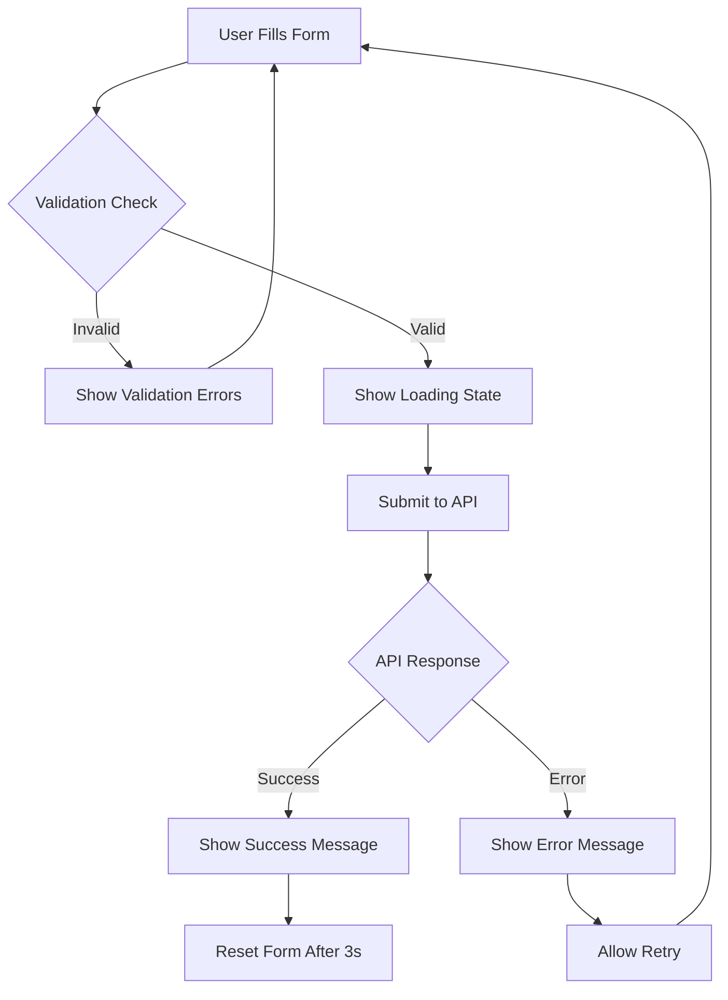

# ContactSection Modern UI/UX Design Specification

## Executive Summary

This document outlines the comprehensive design specification for modernizing the ContactSection component of the cybersecurity website. The current implementation lacks functionality, modern UX patterns, and accessibility features. This specification addresses all identified issues while maintaining consistency with the established cybersecurity theme.

## Current State Analysis

### Critical Issues Identified

- **Non-functional form**: No JavaScript functionality or form submission handling
- **Poor UX**: No user feedback, validation, or loading states
- **Accessibility gaps**: Missing ARIA labels, keyboard navigation, and screen reader support
- **Outdated design**: Basic styling without modern interaction patterns
- **Mobile optimization**: Limited responsive design considerations
- **No state management**: Form lacks proper state handling and validation

### Existing Design Patterns

- **Color Scheme**: Dark blue gradient backgrounds (`#0a1833`, `#11224d`) with cyan accents (`#cyan-300`, `#cyan-400`)
- **Typography**: Geist Sans font family with bold headings and clean text
- **Layout**: Consistent card-based design with gradient backgrounds and blur effects
- **Interactive Elements**: Hover states with color transitions and shadow effects

## Component Architecture Plan

### 1. Component Structure

```
ContactSection/
├── ContactSection.tsx (Main component)
├── components/
│   ├── ContactForm.tsx (Form logic and validation)
│   ├── FormField.tsx (Reusable form field component)
│   ├── SubmissionStatus.tsx (Success/error feedback)
│   └── ContactInfo.tsx (Contact details and social links)
├── hooks/
│   ├── useContactForm.ts (Form state management)
│   └── useFormValidation.ts (Validation logic)
├── types/
│   └── contact.types.ts (TypeScript interfaces)
└── utils/
    ├── validation.ts (Validation functions)
    └── api.ts (Form submission logic)
```

### 2. State Management Architecture

```typescript
interface ContactFormState {
  fields: {
    name: string;
    email: string;
    subject: string;
    message: string;
    company?: string;
    phone?: string;
  };
  validation: {
    errors: Record<string, string>;
    touched: Record<string, boolean>;
    isValid: boolean;
  };
  submission: {
    isSubmitting: boolean;
    isSubmitted: boolean;
    status: "idle" | "submitting" | "success" | "error";
    message?: string;
  };
}
```

### 3. Component Hierarchy

```
ContactSection
├── BackToHomeButton
├── ContactFormContainer
│   ├── FormHeader
│   ├── ContactForm
│   │   ├── FormField (name)
│   │   ├── FormField (email)
│   │   ├── FormField (subject)
│   │   ├── FormField (company - optional)
│   │   ├── FormField (phone - optional)
│   │   ├── FormField (message)
│   │   └── SubmitButton
│   └── SubmissionStatus
└── ContactInfo
    ├── DirectContactDetails
    └── SocialLinks
```

## Visual Design Specification

### 1. Layout Design

#### Desktop Layout (≥1024px)

```
┌─────────────────────────────────────────────────────────────┐
│                    [← Back to Home]                        │
├─────────────────────────────────────────────────────────────┤
│  ┌─────────────────────┐  ┌─────────────────────────────┐   │
│  │                     │  │                             │   │
│  │    Contact Form     │  │     Contact Info            │   │
│  │                     │  │                             │   │
│  │  [Name Field]       │  │  📧 info@cyberdemo.com      │   │
│  │  [Email Field]      │  │  📞 +1 (555) 123-4567      │   │
│  │  [Subject Field]    │  │  📍 123 Security St.        │   │
│  │  [Company Field]    │  │                             │   │
│  │  [Phone Field]      │  │  🔗 Social Links            │   │
│  │  [Message Field]    │  │  Twitter | LinkedIn         │   │
│  │                     │  │  GitHub | Discord           │   │
│  │  [Submit Button]    │  │                             │   │
│  │                     │  │  ⏰ Response Time           │   │
│  │  [Status Message]   │  │  Usually within 24 hours    │   │
│  └─────────────────────┘  └─────────────────────────────┘   │
└─────────────────────────────────────────────────────────────┘
```

#### Mobile Layout (≤768px)

```
┌─────────────────────────────┐
│    [← Back to Home]         │
├─────────────────────────────┤
│                             │
│      Contact Form           │
│                             │
│    [Name Field]             │
│    [Email Field]            │
│    [Subject Field]          │
│    [Company Field]          │
│    [Phone Field]            │
│    [Message Field]          │
│                             │
│    [Submit Button]          │
│                             │
│    [Status Message]         │
│                             │
├─────────────────────────────┤
│                             │
│     Contact Info            │
│                             │
│  📧 info@cyberdemo.com      │
│  📞 +1 (555) 123-4567      │
│  📍 123 Security St.        │
│                             │
│  🔗 Social Links            │
│  Twitter | LinkedIn         │
│  GitHub | Discord           │
│                             │
│  ⏰ Response Time           │
│  Usually within 24 hours    │
└─────────────────────────────┘
```

### 2. Color Scheme & Typography

#### Primary Colors

- **Background Gradient**: `from-[#0a1833] via-[#11224d] to-[#0a1833]`
- **Card Background**: `bg-[#11224d]/80`
- **Primary Accent**: `#22d3ee` (cyan-400)
- **Secondary Accent**: `#67e8f9` (cyan-300)
- **Text Primary**: `#dbeafe` (blue-100)
- **Text Secondary**: `#bfdbfe` (blue-200)

#### State Colors

- **Success**: `#10b981` (emerald-500)
- **Error**: `#ef4444` (red-500)
- **Warning**: `#f59e0b` (amber-500)
- **Info**: `#3b82f6` (blue-500)

#### Typography Scale

- **Heading 1**: `text-3xl font-extrabold` (30px, 800 weight)
- **Heading 2**: `text-2xl font-bold` (24px, 700 weight)
- **Heading 3**: `text-xl font-semibold` (20px, 600 weight)
- **Body**: `text-base` (16px, 400 weight)
- **Small**: `text-sm` (14px, 400 weight)
- **Caption**: `text-xs` (12px, 400 weight)

### 3. Form Field Design

#### Floating Label Pattern

```css
.form-field {
  position: relative;
  margin-bottom: 1.5rem;
}

.form-input {
  width: 100%;
  padding: 1rem 1rem 0.5rem 1rem;
  background: rgba(17, 34, 77, 0.8);
  border: 2px solid rgba(34, 211, 238, 0.3);
  border-radius: 0.5rem;
  color: #dbeafe;
  font-size: 1rem;
  transition: all 0.3s ease;
}

.form-input:focus {
  outline: none;
  border-color: #22d3ee;
  box-shadow: 0 0 0 3px rgba(34, 211, 238, 0.1);
}

.form-label {
  position: absolute;
  left: 1rem;
  top: 1rem;
  color: #67e8f9;
  font-size: 1rem;
  transition: all 0.3s ease;
  pointer-events: none;
}

.form-input:focus + .form-label,
.form-input:not(:placeholder-shown) + .form-label {
  top: 0.25rem;
  font-size: 0.75rem;
  color: #22d3ee;
}
```

## Form Functionality & State Management

### 1. Form Validation Rules

#### Field Validation

- **Name**: Required, 2-50 characters, letters and spaces only
- **Email**: Required, valid email format, max 100 characters
- **Subject**: Required, 5-100 characters
- **Message**: Required, 10-1000 characters
- **Company**: Optional, max 100 characters
- **Phone**: Optional, valid phone format

#### Real-time Validation

```typescript
const validationRules = {
  name: {
    required: true,
    minLength: 2,
    maxLength: 50,
    pattern: /^[a-zA-Z\s]+$/,
    message: "Name must be 2-50 characters, letters only",
  },
  email: {
    required: true,
    maxLength: 100,
    pattern: /^[^\s@]+@[^\s@]+\.[^\s@]+$/,
    message: "Please enter a valid email address",
  },
  subject: {
    required: true,
    minLength: 5,
    maxLength: 100,
    message: "Subject must be 5-100 characters",
  },
  message: {
    required: true,
    minLength: 10,
    maxLength: 1000,
    message: "Message must be 10-1000 characters",
  },
};
```

### 2. Form Submission Flow



### 3. Loading States & Micro-interactions

#### Submit Button States

- **Default**: Cyan background with hover effect
- **Loading**: Spinner animation with "Sending..." text
- **Success**: Green background with checkmark icon
- **Error**: Red background with retry option

#### Form Field Interactions

- **Focus**: Border color change and glow effect
- **Valid**: Subtle green border indicator
- **Invalid**: Red border with error message
- **Typing**: Real-time character count for message field

## User Feedback Systems

### 1. Validation Feedback

#### Error States

```typescript
interface ValidationError {
  field: string;
  message: string;
  type: "required" | "format" | "length" | "pattern";
}

const ErrorMessage = ({ error }: { error: ValidationError }) => (
  <div className="flex items-center mt-1 text-red-400 text-sm">
    <ExclamationCircleIcon className="w-4 h-4 mr-1" />
    {error.message}
  </div>
);
```

#### Success States

```typescript
const SuccessMessage = () => (
  <div className="p-4 bg-emerald-900/20 border border-emerald-500/30 rounded-lg">
    <div className="flex items-center text-emerald-400">
      <CheckCircleIcon className="w-5 h-5 mr-2" />
      <span className="font-semibold">Message sent successfully!</span>
    </div>
    <p className="text-emerald-300 text-sm mt-1">
      We'll get back to you within 24 hours.
    </p>
  </div>
);
```

### 2. Loading Indicators

#### Button Loading State

```typescript
const SubmitButton = ({ isLoading, isSubmitted }) => (
  <button
    type="submit"
    disabled={isLoading}
    className={`
      w-full py-3 px-6 rounded-lg font-semibold text-white
      transition-all duration-300 transform
      ${
        isLoading
          ? "bg-cyan-600 cursor-not-allowed"
          : "bg-cyan-600 hover:bg-cyan-500 hover:scale-105"
      }
      ${isSubmitted ? "bg-emerald-600" : ""}
    `}
  >
    {isLoading ? (
      <div className="flex items-center justify-center">
        <Spinner className="w-5 h-5 mr-2" />
        Sending Message...
      </div>
    ) : isSubmitted ? (
      <div className="flex items-center justify-center">
        <CheckIcon className="w-5 h-5 mr-2" />
        Message Sent!
      </div>
    ) : (
      "Send Message"
    )}
  </button>
);
```

## Modern UI Patterns & Micro-interactions

### 1. Floating Labels Implementation

```typescript
const FloatingLabelField = ({
  id,
  type,
  value,
  onChange,
  label,
  error,
  required,
}) => {
  const [isFocused, setIsFocused] = useState(false);
  const hasValue = value.length > 0;

  return (
    <div className="relative mb-6">
      <input
        id={id}
        type={type}
        value={value}
        onChange={onChange}
        onFocus={() => setIsFocused(true)}
        onBlur={() => setIsFocused(false)}
        className={`
          w-full px-4 pt-6 pb-2 bg-[#11224d]/80 border-2 rounded-lg
          text-blue-100 transition-all duration-300
          ${
            error
              ? "border-red-500 focus:border-red-400"
              : "border-cyan-700/30 focus:border-cyan-400"
          }
          focus:outline-none focus:ring-2 focus:ring-cyan-400/20
        `}
        placeholder=" "
      />
      <label
        htmlFor={id}
        className={`
          absolute left-4 transition-all duration-300 pointer-events-none
          ${
            isFocused || hasValue
              ? "top-2 text-xs text-cyan-300"
              : "top-4 text-base text-cyan-400/70"
          }
        `}
      >
        {label} {required && <span className="text-red-400">*</span>}
      </label>
      {error && (
        <div className="mt-1 text-red-400 text-sm flex items-center">
          <ExclamationCircleIcon className="w-4 h-4 mr-1" />
          {error}
        </div>
      )}
    </div>
  );
};
```

### 2. Progressive Enhancement

#### Character Counter for Message Field

```typescript
const MessageField = ({ value, onChange, maxLength = 1000 }) => {
  const remaining = maxLength - value.length;
  const isNearLimit = remaining < 100;

  return (
    <div className="relative">
      <textarea
        value={value}
        onChange={onChange}
        maxLength={maxLength}
        rows={4}
        className="w-full p-4 bg-[#11224d]/80 border-2 border-cyan-700/30 
                   rounded-lg text-blue-100 focus:border-cyan-400 
                   focus:outline-none focus:ring-2 focus:ring-cyan-400/20
                   resize-none transition-all duration-300"
        placeholder="Tell us about your security needs..."
      />
      <div
        className={`
        absolute bottom-2 right-2 text-xs
        ${isNearLimit ? "text-amber-400" : "text-cyan-400/70"}
      `}
      >
        {remaining} characters remaining
      </div>
    </div>
  );
};
```

### 3. Hover & Focus Effects

```css
/* Card hover effect */
.contact-card {
  transition: all 0.3s cubic-bezier(0.4, 0, 0.2, 1);
}

.contact-card:hover {
  transform: translateY(-2px);
  box-shadow: 0 20px 25px -5px rgba(0, 0, 0, 0.1), 0 10px 10px -5px rgba(0, 0, 0, 0.04),
    0 0 0 1px rgba(34, 211, 238, 0.1);
}

/* Button press effect */
.submit-button {
  transition: all 0.2s cubic-bezier(0.4, 0, 0.2, 1);
}

.submit-button:active {
  transform: scale(0.98);
}

/* Input focus glow */
.form-input:focus {
  box-shadow: 0 0 0 3px rgba(34, 211, 238, 0.1), 0 0 20px rgba(34, 211, 238, 0.05);
}
```

## Mobile-First Responsive Design

### 1. Breakpoint Strategy

```css
/* Mobile First Approach */
.contact-section {
  /* Base styles for mobile (320px+) */
  padding: 1rem;
}

/* Small tablets (640px+) */
@media (min-width: 640px) {
  .contact-section {
    padding: 1.5rem;
  }
}

/* Tablets (768px+) */
@media (min-width: 768px) {
  .contact-section {
    padding: 2rem;
  }

  .contact-grid {
    display: grid;
    grid-template-columns: 1fr;
    gap: 2rem;
  }
}

/* Desktop (1024px+) */
@media (min-width: 1024px) {
  .contact-grid {
    grid-template-columns: 2fr 1fr;
    gap: 3rem;
  }
}

/* Large desktop (1280px+) */
@media (min-width: 1280px) {
  .contact-section {
    padding: 3rem;
  }
}
```

### 2. Touch-Friendly Design

#### Minimum Touch Targets

- **Buttons**: Minimum 44px height
- **Form fields**: Minimum 48px height
- **Links**: Minimum 44px touch area
- **Spacing**: 8px minimum between interactive elements

#### Mobile Optimizations

```css
/* Larger touch targets on mobile */
@media (max-width: 768px) {
  .form-input {
    min-height: 48px;
    font-size: 16px; /* Prevents zoom on iOS */
  }

  .submit-button {
    min-height: 48px;
    font-size: 18px;
  }

  .back-button {
    min-height: 44px;
    padding: 12px 24px;
  }
}
```

### 3. Responsive Typography

```css
/* Fluid typography */
.section-title {
  font-size: clamp(1.5rem, 4vw, 3rem);
  line-height: 1.2;
}

.form-label {
  font-size: clamp(0.875rem, 2vw, 1rem);
}

.body-text {
  font-size: clamp(0.875rem, 2.5vw, 1rem);
  line-height: 1.6;
}
```

## Accessibility Implementation

### 1. ARIA Labels & Roles

```typescript
const ContactForm = () => (
  <form
    role="form"
    aria-labelledby="contact-form-title"
    aria-describedby="contact-form-description"
    onSubmit={handleSubmit}
  >
    <h2 id="contact-form-title" className="sr-only">
      Contact Form
    </h2>
    <p id="contact-form-description" className="sr-only">
      Fill out this form to send us a message. All required fields are marked
      with an asterisk.
    </p>

    <div role="group" aria-labelledby="personal-info">
      <h3 id="personal-info" className="sr-only">
        Personal Information
      </h3>

      <FormField
        id="name"
        type="text"
        label="Full Name"
        required
        aria-describedby="name-error"
        aria-invalid={errors.name ? "true" : "false"}
      />

      <FormField
        id="email"
        type="email"
        label="Email Address"
        required
        aria-describedby="email-error email-help"
        aria-invalid={errors.email ? "true" : "false"}
      />
    </div>
  </form>
);
```

### 2. Keyboard Navigation

```typescript
const useKeyboardNavigation = () => {
  useEffect(() => {
    const handleKeyDown = (event: KeyboardEvent) => {
      // Escape key closes any open modals/dropdowns
      if (event.key === "Escape") {
        // Handle escape logic
      }

      // Enter key submits form when focused on submit button
      if (event.key === "Enter" && event.target === submitButtonRef.current) {
        handleSubmit();
      }
    };

    document.addEventListener("keydown", handleKeyDown);
    return () => document.removeEventListener("keydown", handleKeyDown);
  }, []);
};
```

### 3. Screen Reader Support

```typescript
const FormField = ({ error, success, ...props }) => (
  <div className="form-field">
    <input
      {...props}
      aria-describedby={`${props.id}-help ${error ? `${props.id}-error` : ""}`}
      aria-invalid={error ? "true" : "false"}
    />

    {/* Help text */}
    <div id={`${props.id}-help`} className="sr-only">
      {props.helpText}
    </div>

    {/* Error message */}
    {error && (
      <div
        id={`${props.id}-error`}
        role="alert"
        aria-live="polite"
        className="error-message"
      >
        {error}
      </div>
    )}

    {/* Success message */}
    {success && (
      <div role="status" aria-live="polite" className="success-message">
        {success}
      </div>
    )}
  </div>
);
```

### 4. Focus Management

```typescript
const useFocusManagement = () => {
  const formRef = useRef<HTMLFormElement>(null);

  const focusFirstError = () => {
    const firstErrorField = formRef.current?.querySelector(
      '[aria-invalid="true"]'
    );
    if (firstErrorField) {
      (firstErrorField as HTMLElement).focus();
    }
  };

  const focusSuccessMessage = () => {
    const successMessage = formRef.current?.querySelector('[role="status"]');
    if (successMessage) {
      (successMessage as HTMLElement).focus();
    }
  };

  return { focusFirstError, focusSuccessMessage };
};
```

## Technical Implementation Approach

### 1. Technology Stack

#### Core Technologies

- **React 19.1.0**: Latest React with concurrent features
- **TypeScript**: Type safety and better developer experience
- **Tailwind CSS 4**: Utility-first styling with custom design system
- **Next.js 15.4.4**: Server-side rendering and routing

#### Additional Libraries

```json
{
  "dependencies": {
    "react-hook-form": "^7.48.2",
    "zod": "^3.22.4",
    "@hookform/resolvers": "^3.3.2",
    "framer-motion": "^10.16.16",
    "react-hot-toast": "^2.4.1",
    "@headlessui/react": "^1.7.17",
    "@heroicons/react": "^2.0.18"
  }
}
```

### 2. Form State Management with React Hook Form

```typescript
import { useForm } from "react-hook-form";
import { zodResolver } from "@hookform/resolvers/zod";
import { z } from "zod";

const contactSchema = z.object({
  name: z
    .string()
    .min(2, "Name must be at least 2 characters")
    .max(50, "Name must be less than 50 characters")
    .regex(/^[a-zA-Z\s]+$/, "Name can only contain letters and spaces"),
  email: z
    .string()
    .email("Please enter a valid email address")
    .max(100, "Email must be less than 100 characters"),
  subject: z
    .string()
    .min(5, "Subject must be at least 5 characters")
    .max(100, "Subject must be less than 100 characters"),
  company: z.string().max(100).optional(),
  phone: z
    .string()
    .regex(/^[\+]?[1-9][\d]{0,15}$/, "Please enter a valid phone number")
    .optional(),
  message: z
    .string()
    .min(10, "Message must be at least 10 characters")
    .max(1000, "Message must be less than 1000 characters"),
});

type ContactFormData = z.infer<typeof contactSchema>;

const useContactForm = () => {
  const {
    register,
    handleSubmit,
    formState: { errors, isSubmitting, isSubmitSuccessful },
    reset,
    watch,
  } = useForm<ContactFormData>({
    resolver: zodResolver(contactSchema),
    mode: "onBlur",
  });

  const onSubmit = async (data: ContactFormData) => {
    try {
      const response = await fetch("/api/contact", {
        method: "POST",
        headers: { "Content-Type": "application/json" },
        body: JSON.stringify(data),
      });

      if (!response.ok) throw new Error("Failed to send message");

      toast.success("Message sent successfully!");
      reset();
    } catch (error) {
      toast.error("Failed to send message. Please try again.");
    }
  };

  return {
    register,
    handleSubmit: handleSubmit(onSubmit),
    errors,
    isSubmitting,
    isSubmitSuccessful,
    watch,
  };
};
```

### 3. Animation Implementation with Framer Motion

```typescript
import { motion, AnimatePresence } from "framer-motion";

const ContactSection = () => (
  <motion.section
    initial={{ opacity: 0, y: 20 }}
    animate={{ opacity: 1, y: 0 }}
    transition={{ duration: 0.6, ease: "easeOut" }}
    className="contact-section"
  >
    <motion.div
      initial={{ opacity: 0, scale: 0.95 }}
      animate={{ opacity: 1, scale: 1 }}
      transition={{ duration: 0.5, delay: 0.2 }}
      className="contact-form-container"
    >
      <ContactForm />
    </motion.div>
  </motion.section>
);

const FormField = ({ error, ...props }) => (
  <motion.div layout className="form-field">
    <input {...props} />
    <AnimatePresence>
      {error && (
        <motion.div
          initial={{ opacity: 0, height: 0 }}
          animate={{ opacity: 1, height: "auto" }}
          exit={{ opacity: 0, height: 0 }}
          transition={{ duration: 0.2 }}
          className="error-message"
        >
          {error}
        </motion.div>
      )}
    </AnimatePresence>
  </motion.div>
);
```

### 4. API Integration

```typescript
// pages/api/contact.ts
import type { NextApiRequest, NextApiResponse } from "next";
import { z } from "zod";

const contactSchema = z.object({
  name: z.string().min(2).max(50),
  email: z.string().email().max(100),
  subject: z.string().min(5).max(100),
  company: z.string().max(100).optional(),
  phone: z.string().optional(),
  message: z.string().min(10).max(1000),
});

export default async function handler(
  req: NextApiRequest,
  res: NextApiResponse
) {
  if (req.method !== "POST") {
    return res.status(405).json({ message: "Method not allowed" });
  }

  try {
    const validatedData = contactSchema.parse(req.body);

    // Here you would integrate with your email service
    // Example: SendGrid, Nodemailer, etc.
    await sendEmail(validatedData);

    res.status(200).json({ message: "Message sent successfully" });
  } catch (error) {
    if (error instanceof z.ZodError) {
      return res.status(400).json({
        message: "Validation error",
        errors: error.errors,
      });
    }

    res.status(500).json({ message: "Internal server error" });
  }
}
```

## Performance Considerations

### 1. Code Splitting & Lazy Loading

```typescript
import { lazy, Suspense } from "react";

const ContactForm = lazy(() => import("./components/ContactForm"));
const ContactInfo = lazy(() => import("./components/ContactInfo"));

const ContactSection = () => (
  <div className="contact-section">
    <Suspense fallback={<FormSkeleton />}>
      <ContactForm />
    </Suspense>
    <Suspense fallback={<InfoSkeleton />}>
      <ContactInfo />
    </Suspense>
  </div>
);
```

### 2. Optimized Bundle Size

```typescript
// Use tree-shaking friendly imports
import { CheckCircleIcon } from "@heroicons/react/24/solid";
import { motion } from "framer-motion";

// Avoid importing entire libraries
// ❌ import * as Icons from '@heroicons/react/24/solid';
// ✅ import { CheckCircleIcon } from '@heroicons/react/24/solid';
```

### 3. Image Optimization

```typescript
import Image from "next/image";

const ContactInfo = () => (
  <div className="contact-info">
    <Image
      src="/images/contact-illustration.webp"
      alt="Contact us illustration"
      width={400}
      height={300}
      priority={false}
      placeholder="blur"
      blurDataURL="data:image/jpeg;base64,..."
    />
  </div>
);
```

## Testing Strategy

### 1. Unit Testing

```typescript
import { render, screen, fireEvent, waitFor } from '@testing-library/react';
import userEvent from '@testing-library/user-event';
import ContactForm
```
